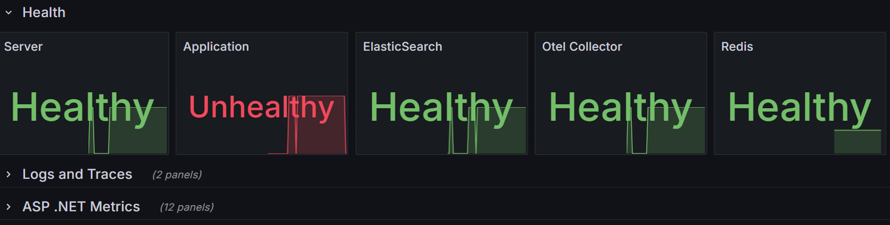

# Button Shop - visualize web store statistics in grafana dashboard

A brilliant inventor has developed a machine for making buttons. In his online store, he sells tons of buttons in three colors: red, green, and blue. On busy days, he wants to plan his work efficiently. He needs to visualize how many orders they have to process to adjust future button production and packing machine operations.


### Business dashboard
Useful dashboard for app user with business statistics. 


### Technical dashboard
Dashboard for admin contains ASP .NET app metrics, logs, traces and docker infrastructure metrics.


Dashboard based on grafana repository dashboards:

- [prometheus-net](https://grafana.com/grafana/dashboards/10427-prometheus-net/)

- [prometheus-net process metrics](https://grafana.com/grafana/dashboards/17039-prometheus-net-process-metrics/)

All of them can be imported through the Grafana UI.

### Actual architecture


### Healthchecks

There are two options. Checking healthchecks directly or via web api. The second solution provides a real check of whether the application can connect to a given service. Additionally, it allows for convenient use of uniform responses by the balckbox service. 




### Run demo

Run all in one docker compose:
```bash
cd src
docker compose up -d
```
Or run infra docker compose and .NET app from VS or dotnet cli command:
```bash
cd infra
docker compose up -d
cd ../src/WebApi
dotnet run # or just run it from VS
```

### TODO 

- [ ] finish dashboards
- [x] aspnet core dashboard
- [x] loki
- [x] open telemetry
- [x] add validation
- [x] Add request behavior to handle custom exceptions
- [x] alerts
- [ ] shop cilents simulations app
- [x] test project
- [x] tracing
- [x] clean architecture
- [x] unit tests
- [x] add ci/cd basic jobs
- [ ] kubernetes
- [x] Dockerfile for app
- [x] docker comppose for app and infra
- [x] move to .NET 9